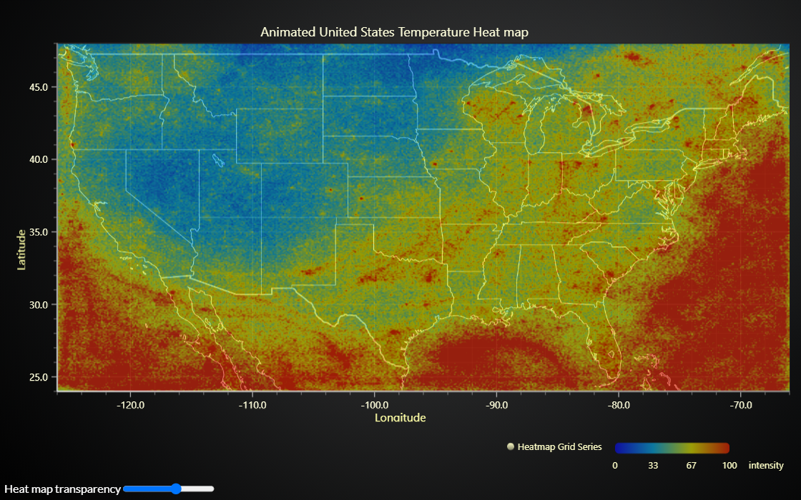

# JavaScript Animated Geographical Temperature Chart

This demo application belongs to the set of examples for LightningChart JS, data visualization library for JavaScript.

LightningChart JS is entirely GPU accelerated and performance optimized charting library for presenting massive amounts of data. It offers an easy way of creating sophisticated and interactive charts and adding them to your website or web application.

The demo can be used as an example or a seed project. Local execution requires the following steps:

-   Make sure that relevant version of [Node.js](https://nodejs.org/en/download/) is installed
-   Open the project folder in a terminal:

          npm install              # fetches dependencies
          npm start                # builds an application and starts the development server

-   The application is available at _http://localhost:8080_ in your browser, webpack-dev-server provides hot reload functionality.

## Description

Example on geographical data visualization by laying a 2D heatmap over a picture of a map.

This example displays a heat map data set of temperature grid measurements on the area of the United States. In geographical data visualization, grid measurements mean that data points are layed with regular latitude and longitude steps.

The data set used in this example has 500 columns (longitude) and 400 rows (latitude). This translates to roughly 12 km step between longitude measurements and 6 km step between latitude measurements. The total number of measurements is 200 000 data points.

The visualization is done by laying a predefined picture of a map under the heatmap, which is styled with transparent colours. This approach is simple, but only suitable when the geographical view is predefined.

LightningChart JS can also be combined with mapping solutions such as [Leaflet](https://leafletjs.com/), which allows the combination of interactive, dynamic maps and the data visualization power of LightningChart.

The picture used in this example is quite low resolution (1600 x 883 px), if a high resolution picture is used, then zooming and panning can be enabled. Otherwise, the map picture would stretch and not look very good.

# Real-Time Geographical Data Visualization

This example also generates a random data set that is used to showcase the real-time capabilities of LightningChart JS - the heat map visualization is animated continuously with smooth 60 refresh rate. Traditionally, this kind of applications do not exist in web pages because it requires too much processing power and results in bad user experience. However, LightningCharts real-time performance oriented heat map features enable running this example as well as even more stressful usage cases on desktop, mobile and tablet devices while leaving plenty of resources for the rest of the web page.

To learn more about the ground-breaking performance differences between LightningChart and traditional data visualization tools, please refer to our [performance comparison studies](https://lightningchart.com/high-performance-javascript-charts/).

**More map examples**:

-   [Data visualization over LightningChart JS Map Charts](https://lightningchart.com/lightningchart-js-interactive-examples/examples/lcjs-example-1103-mapChartVizXY.html)
-   [Data visualization over Google Maps](https://blog.arction.com/easy-geospatial-data-visualization-with-lightningchart-js-and-google)
-   [LightningChart JS Map Charts with Drill-down](https://lightningchart.com/lightningchart-js-interactive-examples/examples/lcjs-example-1111-covidDrillDownDashboard.html)
-   [Simple Countries Visualization](https://lightningchart.com/lightningchart-js-interactive-examples/examples/lcjs-example-1101-mapChartDynamicColor.html)

# About LightningChart Heatmaps Performance

Since September 2021, LightningChart JS is the proven performance leader in real-time and static heatmaps visualization in the web.

At that time, we took the initiative to compare the performance of the different commercial data visualization tools as well as open source tools, who offer generic heatmap chart solutions. You can find the study description and results [here](https://lightningchart.com/js-heatmaps-performance-comparison/).

The most important finding from this study was that the maximum data visualization capacity of LightningChart JS greatly exceeds that of any other visualization library, being able to display more than **5 billion data points**. In context of this example, this translates to the latitude/longitude step between measurements that can be interpreted.

Another performance attribute where LightningChart dominated was real-time updates - for example, updating the heatmap data displayed over this map.
This is a crucial feature in real-time geographical data monitoring applications.

## API Links

* [ColorRGBA]
* [ImageFill]
* [ImageFitMode]
* [LUT]

## Support

If you notice an error in the example code, please open an issue on [GitHub][0] repository of the entire example.

Official [API documentation][1] can be found on [LightningChart][2] website.

If the docs and other materials do not solve your problem as well as implementation help is needed, ask on [StackOverflow][3] (tagged lightningchart).

If you think you found a bug in the LightningChart JavaScript library, please contact support@lightningchart.com.

Direct developer email support can be purchased through a [Support Plan][4] or by contacting sales@lightningchart.com.

[0]: https://github.com/Arction/
[1]: https://lightningchart.com/lightningchart-js-api-documentation/
[2]: https://lightningchart.com
[3]: https://stackoverflow.com/questions/tagged/lightningchart
[4]: https://lightningchart.com/support-services/

© LightningChart Ltd 2009-2022. All rights reserved.

[ColorRGBA]: https://lightningchart.com/js-charts/api-documentation/v5.0.1/functions/ColorRGBA.html
[ImageFill]: https://lightningchart.com/js-charts/api-documentation/v5.0.1/classes/ImageFill.html
[ImageFitMode]: https://lightningchart.com/js-charts/api-documentation/v5.0.1/enums/ImageFitMode.html
[LUT]: https://lightningchart.com/js-charts/api-documentation/v5.0.1/classes/LUT.html

